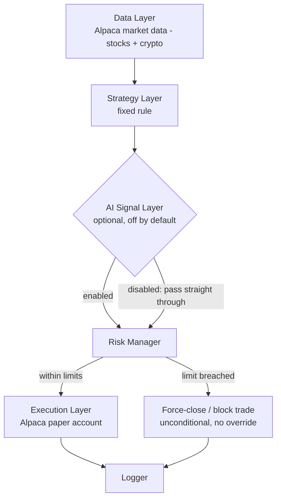

# Automated Trading System — Architecture and Build Plan

**Status: PLANNING STAGE.** Nothing described below is running. No exchange account, no wallet, no API key, and no capital is connected. Nothing beyond this document gets built until it is reviewed and approved, phase by phase.

No system, rule-based or AI-based, can guarantee profit or a specific return. This plan specifies mechanics and safeguards. It does not estimate returns, because none can be honestly stated in advance.

---

## 1. What this system is

A pipeline that: reads market data → runs it through a strategy → checks the proposed trade against fixed risk rules → executes the trade (in a simulator, not on a real account, until explicitly changed).

**Broker: Alpaca** (confirmed). Alpaca is used as the single data source and execution venue for both equities and crypto. Options are explicitly excluded from Phases 1–4 below and scoped separately — see Section 6.

Every stage is deterministic (plain code, fixed rules) except one optional stage (an AI signal filter), which is off by default and, when on, can only ever produce an opinion — never an order, and never a change to the risk rules.

## 2. Components

| Component | Responsibility | Type | Runs by default? |
|---|---|---|---|
| Data Layer | Pulls price/volume history and live quotes | Rule-based | Yes |
| Strategy Layer | Turns data into a buy/sell/hold decision, from a fixed, coded rule (e.g. moving-average cross, breakout) | Rule-based | Yes |
| AI Signal Layer | Optional second opinion on a candidate trade, using an LLM call | AI (LLM) | **No — disabled** |
| Risk Manager | Checks every proposed trade and the whole account against fixed limits; can force-close positions | Rule-based | Yes |
| Execution Layer | Sends the approved order to a paper (simulated) exchange adapter now; a live adapter is a separate, gated module added later | Rule-based | Yes (paper only) |
| Logger | Writes every decision, every risk check, and every order (simulated or real) to a file, with the reason | Rule-based | Yes |

## 3. Data flow

The Risk Manager sits after the Strategy/AI stage and before Execution. It is the last check before anything is sent to the Execution Layer, and it is not part of either the Strategy Layer or the AI Signal Layer's code path.

## 4. Risk Manager — exact rules

Proposed starting limits (conservative defaults — adjust and confirm before Phase 3, do not trade on unconfirmed numbers):

| Limit | Proposed default |
|---|---|
| Max loss per day | 2% of account equity — halts new trades for the rest of the day |
| Max size of any single position | 10% of account equity |
| Max number of concurrent open positions | 3 |
| Minimum cash buffer kept unallocated | 30% of account equity, at all times |

**Non-override rule:** once a hard limit is hit, the resulting action (block the trade, or close the position) executes unconditionally. No component — Strategy Layer, AI Signal Layer, or any future addition — can delay, veto, or request reconsideration of that action, and there is no configuration flag that routes the decision back through an LLM call.

This is a direct fix to a specific pattern found during review of third-party reference code (Moon Dev's `moon-dev-ai-agents` project, `risk_agent.py`): there, hitting a loss limit by default triggers a call back to the same class of LLM that generates trade signals, asking it whether to override the limit ("OVERRIDE" / "RESPECT_LIMIT"). That makes the stop-loss only as reliable as the model call that is allowed to cancel it. This system does not carry that pattern forward: the limit check and the action it triggers contain no model call anywhere in between.

**Kill switch:** a single manual control (a status file or command checked on every loop iteration) that halts all new orders and, at the operator's choice, closes all open positions. It is checked by the Execution Layer directly, independent of the Strategy or AI layers, so it works even if either of those is stuck or misbehaving.

**Broker-level backstop (defense in depth):** every entry order is submitted to Alpaca as a **bracket order** (entry + take-profit + stop-loss, in one order — supported natively by `alpaca-py`). This means the per-trade stop-loss is enforced by Alpaca's own servers from the moment the order is filled, independent of whether this system's own process is even still running. This does not replace the account-level checks above (a per-trade bracket stop cannot see or limit total daily loss across several open positions at once) — it adds a second, independent layer under it.

## 5. AI Signal Layer (optional)

Disabled by default. If enabled, it does not place trades — it produces a label (`buy` / `sell` / `hold`) and a short reason from the same market data the Strategy Layer already has, and the Strategy Layer decides whether to weigh it. It has no access to the account, to order placement, or to the Risk Manager's configuration.

**Model:** `claude-haiku-4-5`. The task (a bounded classification from structured, already-summarized indicators) does not need a larger model, and it is Anthropic's lowest-cost current-generation model — the right choice given the request to keep running costs minimal. `claude-sonnet-5` is the direct upgrade path if Haiku's judgment proves too coarse in backtesting.

**Cost, worked example** (one monitored asset, a check every 15 minutes, ~1,500 input tokens and ~150 output tokens per check — a realistic size for a data summary plus a short instruction):

| | Per month |
|---|---|
| Checks | 2,880 (96/day × 30) |
| Input tokens | 4.32M × $1.00/MTok = $4.32 |
| Output tokens | 0.43M × $5.00/MTok = $2.16 |
| **Total** | **≈ $6.50/month** |

Scales roughly linearly with the number of monitored assets and the check frequency (e.g., 3 assets at the same frequency ≈ $19–20/month). Prompt caching can reduce the input-token cost further if the fixed instruction portion of the prompt is large relative to the per-check data; not needed at this scale.

**Zero-cost path:** leave this layer disabled. The Strategy and Risk layers are plain code and incur no API cost at all; the only running cost in that configuration is whatever compute you already have (your own machine).

## 5a. Implementation stack and starting strategy (Phase 1)

**Corrected from the previous draft:** Freqtrade and CCXT are built for crypto exchanges specifically and do not fit a stocks/options broker like Alpaca — running Alpaca through them would mean unofficial workarounds, exactly as flagged in review. They are dropped. Since Alpaca covers stocks **and** crypto through one account and one API, this plan now uses a single stack for both, instead of two parallel systems:

- **`alpaca-py`** (Alpaca's official Python SDK) — market data and order execution, for both stocks and crypto, for paper and live alike (switching from paper to live is a key pair and endpoint change, not a code change).
- **`backtesting.py` or `vectorbt`** — backtesting engine. Both are broker-agnostic (they run on a plain price-history table), so they work unchanged with data pulled from `alpaca-py` instead of CCXT.

**Options are excluded from Phases 1–4.** A buy/sell/hold strategy has no notion of expiration, assignment, or the Greeks that actually drive an option's risk — bolting options onto that logic would be a real gap, not a feature. If you want options, they need their own strategy model and their own section of this plan, scoped separately, after the stock/crypto pipeline is proven.

**Starting strategy for the first backtest: EMA 50/200 crossover with an ADX trend filter** (enter long only when the 50-period EMA is above the 200-period EMA *and* ADX(14) is above 20, i.e., only act on the cross in a trending market; exit on the reverse cross or ADX dropping back below the threshold), on a 4-hour timeframe, for a stock and a crypto pair traded on Alpaca. The plain crossover is well known for whipsaws in choppy, range-bound conditions — the ADX filter is the standard, still-simple fix, added specifically for that reason. This remains scaffolding to prove the pipeline (data → strategy → risk check → paper execution → log) works end to end, not a claim that it is a good trading edge; it can be replaced later without changing anything else in this plan.

**Data plan:** Alpaca's free Basic market data plan (IEX feed for equities, indicative feed for options — options data isn't used here anyway) is enough for Phase 1–3. The paid Algo Trader Plus tier (full consolidated SIP coverage) is a Phase 4+ upgrade to consider only if paper-trading results turn out to be sensitive to IEX's partial coverage.

**Note on account rules:** FINRA retired the old Pattern Day Trader rule (the $25,000 minimum to day-trade) in 2026 in favor of a dynamic, intraday-margin-based framework; Alpaca's current documentation describes the new framework. This plan's own position-size and concurrent-position limits (Section 4) are set independently of whatever the broker's margin framework allows, so this is background context, not something the plan depends on — confirm the specifics on the account at signup.

## 5b. Monitoring and dashboard

Every Alpaca account (paper and live alike) has a free, built-in web dashboard at alpaca.markets showing open positions, order history, and the account equity curve in real time — no code required for this baseline view, and it directly covers the gap in the earlier draft (this system has no separate per-agent or multi-agent view, since Section 5 is a single optional signal source, not several competing agents; see Section 11 for why a multi-agent setup was not adopted).

If that built-in view is not enough once the system is running (e.g., you want the Strategy Layer's reasoning and the AI Signal Layer's opinion shown side by side with the trade log), a small custom dashboard (e.g., a Streamlit app reading the Logger's output files) is a Phase 2+ addition, scoped once there is a concrete gap to point at.

## 6. Execution Layer

**Phases 0–3 (this plan, backtesting, paper trading):** Alpaca's paper trading endpoint — a free, real-time simulation environment using real market data, running the same order code (including bracket orders, Section 4) that live trading uses. Nothing is sent to a live account; no funding is involved.

**Moving to live trading** is a configuration change (a live-mode key pair and the live API endpoint instead of paper) to the same code, not a rewrite — this is a specific advantage of building on Alpaca directly rather than a custom simulator. It still requires, separately and explicitly:
- A funded live account.
- An agreed, small capital cap for the first live order.
- A final review of this plan's Section 4 limits against the live account's actual size.

**Options** are not part of any phase in this plan (Section 5a) and have no execution path here. A wallet-private-key-based execution model (as used in the reviewed third-party code, for Solana and Hyperliquid) is also out of scope: Alpaca's API-key model, scoped to a specific account with standard brokerage safeguards, is what this plan uses instead.

## 7. What is needed from you, by phase

| Phase | Requirement |
|---|---|
| 0 — this plan | Nothing |
| 1 — strategy + backtest | A free Alpaca account and a **paper-mode** API key/secret pair (no funding, no identity verification for a paper-only account) — added through this coding environment's own secrets settings when Phase 1 build starts, never pasted into chat |
| 2 — paper trading | Same paper-mode key pair as Phase 1 |
| 3 — AI Signal Layer (if you choose to enable it) | One Claude API key, added the same way |
| 4 — live trading (only after separate, explicit approval) | A funded Alpaca account, its **live-mode** key pair, and the agreed capital cap |

## 8. Cost summary

| Phase | One-time cost | Recurring cost |
|---|---|---|
| 0–2 (plan, backtest, paper trading) | $0 | $0 (Alpaca account + Basic data plan are free) |
| 3 (AI Signal Layer, optional) | $0 | ≈ $6.50/month per monitored asset at a 15-minute check interval (Section 5) |
| 4 (live trading) | $0 | Standard Alpaca trading commissions/spreads only — not a cost of this system; Algo Trader Plus data (optional) is a separate paid upgrade if Basic proves insufficient |

## 9. Source material reviewed

- `github.com/moondevonyt` — full repository listing (27 public repos).
- `moondevonyt/Harvard-Algorithmic-Trading-with-AI` — teaches the Research → Backtest → Implement workflow this plan's Phase 1–2 follows.
- `AlgoOps25/moondev_ai_agents` — a surviving fork of an earlier (January 2025) release of Moon Dev's agent code; reviewed at the source level (17 agent modules, `risk_agent.py`, `config.py`, `base_agent.py`, `.env_example`). This is where the override pattern in Section 4 was found.
- `algotradecamp.com` — Moon Dev's paid program, noted for context only; no code or content from it was used here.
- Current (2026) reporting on crypto exchange access for Israeli residents — background only, superseded by the Alpaca decision below; kept for reference in case a direct crypto-exchange integration is revisited later.
- `alpaca.markets` and `docs.alpaca.markets` (Trading API, Market Data API, Options Trading, order types and order classes, the alpaca-py SDK and its GitHub repo) — confirmed free paper trading, bracket order support, Basic vs. Algo Trader Plus data plans, and the 2026 PDT rule change (Sections 4–7).

## 10. Decisions — approved

All approved, as follows. Phase 1 build proceeds on this basis; re-approve this section before changing any of it.

1. Risk limits (Section 4): 2% max daily loss / 10% max position size / 3 max concurrent positions / 30% min cash buffer.
2. Stack (Section 5a): `alpaca-py` + `backtesting.py`/`vectorbt`.
3. Starting strategy (Section 5a): EMA 50/200 crossover with an ADX(14) trend filter on 4h candles, pipeline-testing only.
4. Test assets: `AAPL` (stock) and `BTC/USD` (crypto) for the first backtest.
5. Options: excluded from Phases 1–4.
6. AI Signal Layer (Section 5): disabled for the initial build.
7. Data plan (Section 5a): free Basic (IEX).
8. Repository: this project lives in the `investment-lab/` subfolder of the already-connected `salary-calculator` repository, on its `claude/focused-babbage-46e808` branch.

## 11. Enhancements considered and explicitly not adopted (with reasons)

Raised in review; each was weighed, not ignored:

| Enhancement | Decision | Why |
|---|---|---|
| Multi-agent debate architecture (separate Bull / Bear / Risk-manager LLM agents arguing before each decision) | **Not adopted as default** | No established evidence a multi-agent debate outperforms one well-scoped model call for this kind of bounded decision, and it directly multiplies API cost (roughly 3–5×+ the calls per decision, before counting debate rounds) — against the explicit goal of minimizing running cost (Section 5). Available as an opt-in variant later if you want to test it against the single-call baseline, with its own cost measured before turning it on, not assumed. |
| Order book / Level 2 depth data, real-time institutional flow tracking | **Not adopted for Phase 1–3** | L2 historical data is normally a separate paid data tier, not available through Alpaca's free Basic plan; real institutional flow (13F filings, etc.) is legally lagged by months for retail regardless of budget, so "real-time institutional tracking" isn't obtainable at any price for a retail account. Neither is needed to validate the mechanical pipeline. Revisit only if a specific, tested strategy shows a measured edge that depends on it. |
| Macro economic calendar (rate decisions, CPI releases, etc.) | **Accepted as a Phase 2 candidate** | Free/low-cost calendar APIs exist; this is a reasonable, cheap addition to the Data Layer once the base pipeline is proven — not required for Phase 1. |
